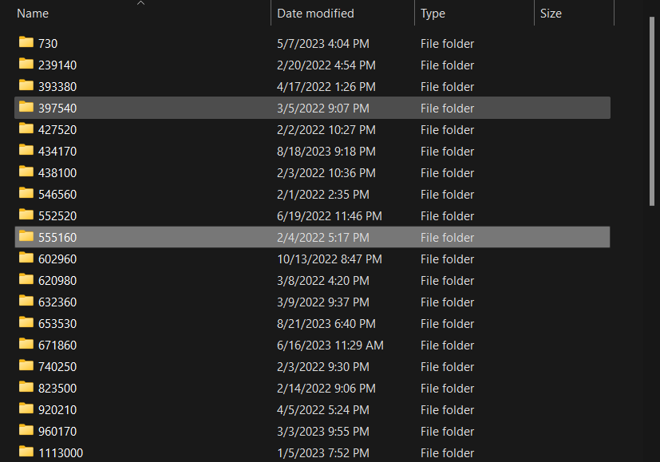
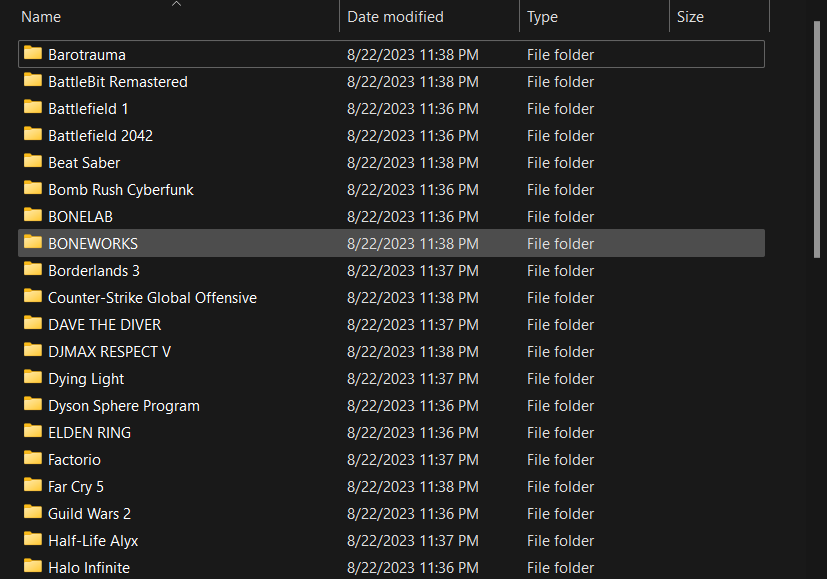

# SteamScreenshotExporter

Choose a folder and this script will export your Steam screenshots from all of your games, convert the folder names from the AppId format Valve indexes them in to the name of each game.

It will query the App List from the Steam API, this may take a moment to download.

## From **THIS!**

## To _**THIS!**_

## To Run

Run SteamScreenshotter.ps1 in PowerShell, it will prompt you for a folder to export to.
